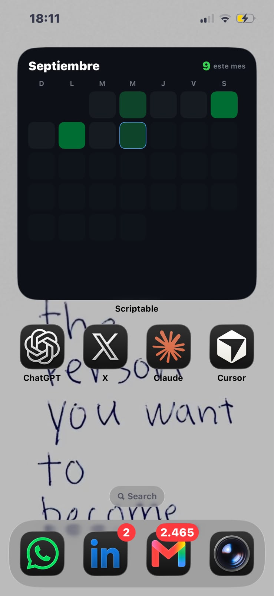

# GitHub Contributions Widget

Widget para la pantalla de inicio de iPhone que muestra tus contribuciones de GitHub del mes actual, con el estilo de cuadrados verdes de la plataforma. Corre sobre [Scriptable](https://scriptable.app) (gratis, App Store) y no depende de ningún backend propio: consulta la API de GitHub directamente desde el widget.



## Características

- Calendario del mes en curso: 7 columnas (días de la semana) por la cantidad de semanas que tenga el mes.
- Cambia de mes automáticamente, porque el mes se calcula en cada ejecución.
- Contador de contribuciones acumuladas del mes, visible en el encabezado.
- El día de hoy queda marcado con un borde.
- Los días futuros del mes se pintan tenues, para mantener la forma del calendario sin mostrar datos que no existen.
- Tamaño de celda calculado a partir de `Device.screenSize()`, así que se adapta a cualquier iPhone.
- Pensado para el tamaño de widget grande.

## Requisitos

- iPhone con iOS 14 o superior.
- App [Scriptable](https://apps.apple.com/app/scriptable/id1405459188) (gratis).
- Cuenta de GitHub.

## Instalación

### 1. Instalar Scriptable

Descargala desde la App Store: [apps.apple.com/app/scriptable](https://apps.apple.com/app/scriptable/id1405459188).

### 2. Crear el Personal Access Token

El widget usa la API GraphQL de GitHub para leer el calendario de contribuciones, y esa API **solo acepta tokens classic**, no fine-grained.

1. Entrá a [github.com/settings/tokens](https://github.com/settings/tokens).
2. **Generate new token → Generate new token (classic)**.
3. Ponele un nombre (por ejemplo `scriptable-widget`) y una expiración.
4. Marcá el permiso `read:user`. No necesitás nada más.
5. Generá el token y copialo — GitHub solo lo muestra una vez.

> Un token **fine-grained** no funciona acá: la API GraphQL de contribuciones no lo reconoce y vas a obtener errores de autenticación aunque el token sea válido.

### 3. Pegar el script

1. Abrí Scriptable y creá un script nuevo.
2. Pegá el contenido de [`GitHubWidget.js`](GitHubWidget.js).
3. Reemplazá los dos placeholders al principio del archivo:

```js
const GITHUB_TOKEN = "TU_TOKEN_AQUI"
const GITHUB_USER = "TU_USUARIO_AQUI"
```

por tu token classic y tu nombre de usuario de GitHub.

4. Corré el script una vez desde Scriptable para confirmar que carga bien (`widget.presentLarge()` se ejecuta automáticamente fuera del widget).

### 4. Agregar el widget a la pantalla de inicio

1. Mantené presionada la pantalla de inicio hasta que entre en modo edición.
2. Tocá **+** y buscá **Scriptable**.
3. Elegí el tamaño **grande**.
4. Agregalo y tocá el widget recién puesto para configurarlo.
5. En **Script** elegí el archivo que pegaste. Dejá **When Interacting** en `Run Script` u **Open App**, como prefieras.

## Personalización

Todo lo que sigue son fragmentos reales de `GitHubWidget.js`.

**Paleta de colores** (intensidad del verde según contribuciones del día):

```js
function colorForCount(count) {
  if (count == 0) return new Color("#161b22")
  if (count <= 2) return new Color("#0e4429")
  if (count <= 4) return new Color("#006d32")
  if (count <= 6) return new Color("#26a641")
  return new Color("#39d353")
}
```

**Color del contador** de contribuciones del mes:

```js
let countLabel = header.addText(`${monthTotal}`)
countLabel.font = Font.boldSystemFont(17)
countLabel.textColor = new Color("#39d353")
```

**Borde del día actual**:

```js
if (day === today) {
  cell.borderWidth = 1.5
  cell.borderColor = new Color("#58a6ff")
}
```

**Redondeo de las celdas**:

```js
cell.cornerRadius = Math.min(box * 0.22, 8)
```

Subí el `0.22` para celdas más redondeadas, bajalo para celdas más cuadradas.

**Idioma de meses y días de la semana**:

```js
const MONTHS = ["Enero","Febrero","Marzo","Abril","Mayo","Junio",
                "Julio","Agosto","Septiembre","Octubre","Noviembre","Diciembre"]
const WEEKDAYS = ["D","L","M","M","J","V","S"]
```

Cambiá estos dos arrays para otro idioma. `WEEKDAYS` empieza en domingo (índice 0), igual que `Date.getDay()` en JavaScript.

## Solución de problemas

**`Bad credentials`**
El token es inválido, expiró, o fue revocado. Generá uno nuevo siguiendo el paso 2 de instalación.

**`Could not resolve to a User`**
`GITHUB_USER` está mal escrito o no existe. Verificá que coincida exactamente con tu nombre de usuario de GitHub (no el nombre completo).

**Widget en blanco o sin datos**
Suele pasar cuando el token es **fine-grained** en vez de classic. La API GraphQL de contribuciones no los soporta: recreá el token como classic con permiso `read:user`.

**Mis contribuciones privadas no aparecen**
El conteo depende de la opción de tu perfil de GitHub *"Include private contributions on my profile"* (en `github.com/settings/profile`). Si está desactivada, la API tampoco te las va a devolver a vos, sea con este widget o mirando tu propio perfil.

## Seguridad

`GITHUB_TOKEN` queda escrito en texto plano dentro del script. **No subas tu script con el token real a un repositorio público** (ni privado, si no confiás en quién puede verlo). Si lo llegaste a subir por error, revocalo inmediatamente en [github.com/settings/tokens](https://github.com/settings/tokens) y generá uno nuevo.

## Licencia

MIT. Ver [LICENSE](LICENSE).
